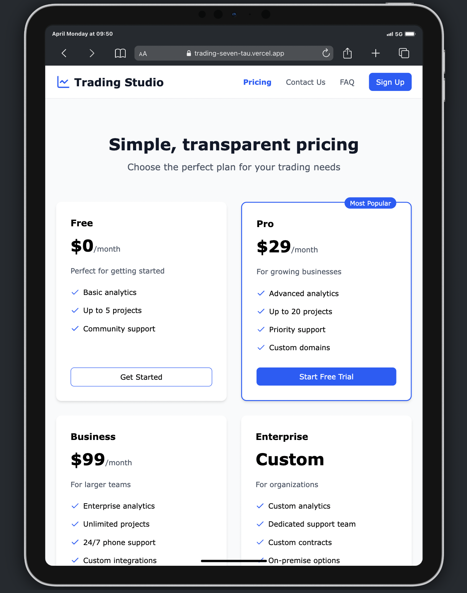
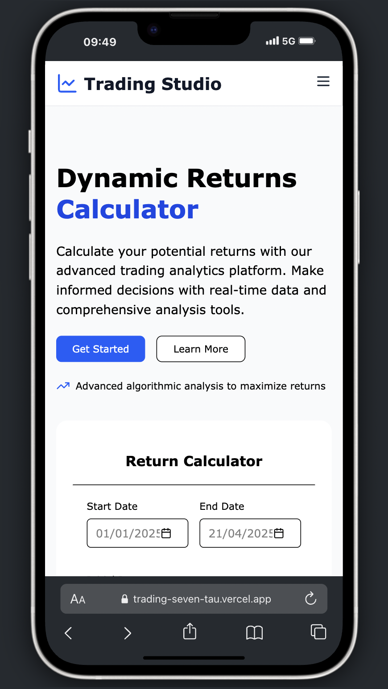

# 💹 Trading Studio

A modern and modular web application built using **React**, **TypeScript**, and **Tailwind CSS**, designed to simulate a trading platform. This was developed as part of an assignment from a rough workflow draft — translating ideas into a polished prototype with structured architecture, clean UI, and an optimized codebase.

---

## 🚀 Features

- 🔐 **Authentication System**
  - Sign up and login with credentials securely stored in **localStorage**.
  - Users must sign up to access the main platform.

- 🌐 **Public Pages**
  - `Home` – Landing page for Trading Studio.
  - `FAQ` – Answers to common questions.
  - `Pricing` – Detailed pricing tiers.
  - `Contact Us` – Get in touch with the team.

- 📊 **Platform Pages** *(Post-Login)*:
  - `Portfolio` – Placeholder for user's holdings.
  - `Strategy` – Create and manage groups and strategies.
  - `Screener` – 4-step form for simulation:
    - Scanner
    - Buy
    - Sell
    - Simulation
  - `Simulator` – Simulated result display based on screener input.

> 🔒 Currently, only authentication data is stored. All strategy and simulation data is static, serving as a proof-of-concept layout for future integration.

---

## 🛠️ Tech Stack

- **React** + **TypeScript** – Component-based and type-safe development
- **Tailwind CSS** – Utility-first styling approach
- **React Router DOM** – Client-side routing
- **LocalStorage** – Lightweight credential persistence

---

## 📁 Project Structure

```plaintext
src/
├── assets/                        # Images and icons
├── common/                        # Reusable global common components 
│   ├── infoBox.tsx
│   ├── inputField.tsx
│   ├── selectField.tsx
│   └── textAreaField.tsx
├── components/                    # Major reusable sections
│   ├── calculatorCard.tsx
│   ├── faq.tsx
│   ├── footer.tsx
│   ├── navbar.tsx
│   ├── portfolioCard.tsx
│   ├── pricingCard.tsx
│   └── simulationSteps.tsx
├── constants/                     # Static options and label content
│   ├── faq.constants.ts
│   ├── features.constants.ts
│   ├── portfolioGroup.constants.ts
│   ├── pricing.constants.ts
│   ├── screenerOptions.constants.ts
│   └── simulator.constants.ts
├── context/
│   └── authContext.tsx           # Auth context for global access
├── interfaces/                   # Type definitions
│   ├── common.interface.ts
│   ├── components.interface.ts
│   └── context.interface.ts
├── pages/                         # Main page components
│   ├── contactUs.tsx
│   ├── faq.tsx
│   ├── home.tsx
│   ├── login.tsx
│   ├── portfolio.tsx
│   ├── pricing.tsx
│   ├── screener.tsx
│   ├── signup.tsx
│   ├── simulator.tsx
│   └── strategy.tsx
├── utils/
│   └── date.utils.ts             # Utility functions
├── app.tsx                       # App entry component
├── main.tsx                      # React root rendering
├── index.css                     # Tailwind & base styles
└── index.ts                      # Central export/index files

## ⚙️ Optimizations & Highlights

- Clean codebase with meaningful abstractions and reusable components.
- Intuitive navigation and user flow from authentication to feature access.
- Clear and scalable folder structure for easy collaboration and maintenance.
- Fully responsive UI using Tailwind CSS utilities.


```

## 🚀 Getting Started

### 1. Clone the Repo

```bash
git clone https://github.com/dummy-co-der/trading.git
cd trading-studio
```

### 2. Install Dependencies

```bash
npm install
```

### 3. Run the App

```bash
npm run dev
```

### 4. Project Screenshot


<div align="center">
  
  
</div>

## 📌 Future Scope

- 🔄 Connect to backend APIs for dynamic data handling and persistence.
- 🧠 Add data validation and analytics in strategy and simulation flows.
- 🔒 Secure authentication with token-based auth.
- 📈 Real-time updates using websockets or polling.

---

## 🙌 Final Thoughts

This project demonstrates how a well-thought-out idea can be brought to life with attention to detail, clean structure, and user-focused design. It reflects my ability to plan, execute, and optimize a complete front-end application even with minimal initial input.
